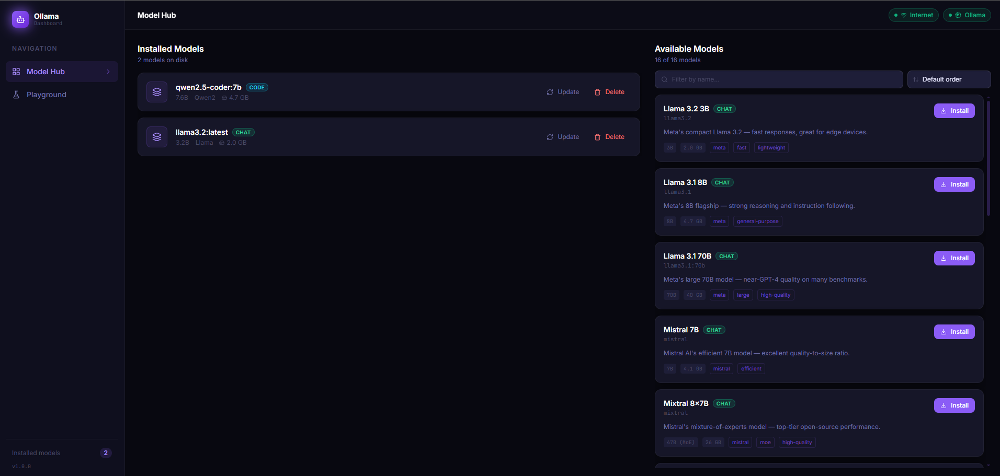

# Ollama Dashboard 🦙



**Ollama Dashboard** es una aplicación full-stack diseñada para simplificar la administración, descarga y uso de modelos de inteligencia artificial locales. Actúa como un panel de control interactivo y un *playground* avanzado, eliminando la necesidad de interactuar exclusivamente mediante la línea de comandos clásica de Ollama.

---

## 🎯 El Problema y la Solución

Mientras que [Ollama](https://ollama.com/) democratiza el acceso a modelos open-source potentes (como Llama 3, Qwen, Phi, entre otros), gestionarlos desde la terminal puede resultar poco intuitivo para usuarios finales cuando se manejan múltiples modelos a la vez.

Este proyecto resuelve ese problema proporcionando a nivel local una **interfaz gráfica moderna y un entorno de chat** completo. Ha sido construido poniendo un foco especial en rendimiento, arquitectura asíncrona y procesamiento robusto de streaming de datos (*Server-Sent Events*).

## ✨ Características Principales

- 📦 **Hub de Modelos:** Explora, instala, actualiza y elimina modelos de IA locales con un simple clic. Visualiza en tiempo real el progreso de las descargas.
- 🏷️ **Categorización Inteligente:** El sistema detecta automáticamente metadatos para informar si un modelo es adecuado para Chat, Embedding, Visión o Código.
- 💬 **Playground Dual:**
  - **Agent Chat:** Una interfaz conversacional dinámica que soporta renderizado avanzado de Markdown (ideal para interpretar fragmentos de código devueltos por la IA).
  - **Raw Console:** Interfaz purista, al estilo terminal de comandos de backend, para elaborar y probar *prompts* estructurados en crudo.
- ⚡ **Streaming Asíncrono en Tiempo Real:** Implementación nativa de *Server-Sent Events (SSE)* consumidos directamente mediante `ReadableStream` en el navegador, brindando respuestas token por token de manera fluida y de muy baja latencia.
- 🛡️ **Tolerancia a Fallos y Manejo de Errores (SOLID):** Cuidado especial en el manejo elegante de desconexiones del cliente web, detención segura de peticiones asíncronas (`asyncio.CancelledError`) e intercepción segura de fallos de la API local de Ollama para evitar vulnerabilidades en el frontend.

## 🛠️ Stack Tecnológico

**Frontend:**
* [React 18](https://react.dev/) / [Vite](https://vitejs.dev/) - Sistema de base moderno para aplicaciones SPA. Entorno de desarrollo ultra rápido.
* [Tailwind CSS](https://tailwindcss.com/) - Framework utilitario para construcción ágil del sistema de diseño de la interfaz.
* *Librerías clave:* `lucide-react` para iconografía limpia y minimalista, y `react-markdown` para interpretación de texto en las respuestas.

**Backend:**
* [Python 3.10+](https://www.python.org/)
* [FastAPI](https://fastapi.tiangolo.com/) - Framework web asíncrono de altísimo rendimiento, ideal para I/O y peticiones de IA.
* *Uvicorn* - Servidor ASGI super rápido.
* Arquitectura de rutas desacopladas siguiendo los principios modernos de inyección de dependencias.

## 🚦 Cómo ponerlo a funcionar

Pensado en facilitar la experiencia del desarrollador (DX), el proyecto incluye un script inteligente central: `run.py`. Éste automatiza completamente procesos que habitualmente demandan pasos por consola separados.

### Prerrequisitos
1. **Python 3.10+** y **Node.js 18+** instalados en el sistema.
2. **[Ollama](https://ollama.com/)** instalado y ejecutando el demonio base en tu máquina.

### Pasos

Abre tu terminal en el directorio raíz del proyecto y ejecuta el siguiente comando:

```bash
python run.py
```

**¿Qué realiza este script paso a paso?**
1. **Detección inteligente:** Verifica si ya se instalaron dependencias (`pip` en backend y `npm` en frontend). Si es la primera ejecución, instala todo de manera automática.
2. **Puesta en marcha concurrente:** Levanta el entorno de servidor en **FastAPI** (`http://localhost:8000`) y de desarrollo **Vite** en paralelo (`http://localhost:5173`).
3. **Auto-Launch del Navegador:** Configurado para abrir de forma automática tu navegador web predeterminado en la dirección del dashboard.
4. **Cierre Controlado:** Al detener el script (`CTRL+C`), se asegura la terminación o "Graceful Shutdown" de ambos procesos, garantizando la liberación limpia de los puertos de desarrollo.

## 🧪 Calidad de Código y TDD (Test-Driven Development)

El proyecto (tanto en el backend como en el frontend) se diseñó y programó manteniendo el paradigma de **TDD** y pruebas rigurosas. La red de ruteo HTTP hacia la API de Ollama y sus casos borde se encuentran respaldados por pruebas unitarias. Asimismo, el frontend al completo se testea emulando integraciones con la API usando RTL y Vitest, superando consistentemente el 80% de cobertura de código.

Para ejecutar los tests del backend con `pytest` y `httpx`:
```bash
cd backend
python -m pytest tests/ -v
```

Para probar el frontend y evaluar el reporte de cobertura de código usando `Vitest` y `v8`:
```bash
cd frontend
npm run coverage
```

---
*Este proyecto está enfocado en demostrar fluidez técnica con stacks de desarrollo web modernos aplicados a resolver un problema concreto en el contexto de nuevas herramientas LLM distribuidas localmente.*
